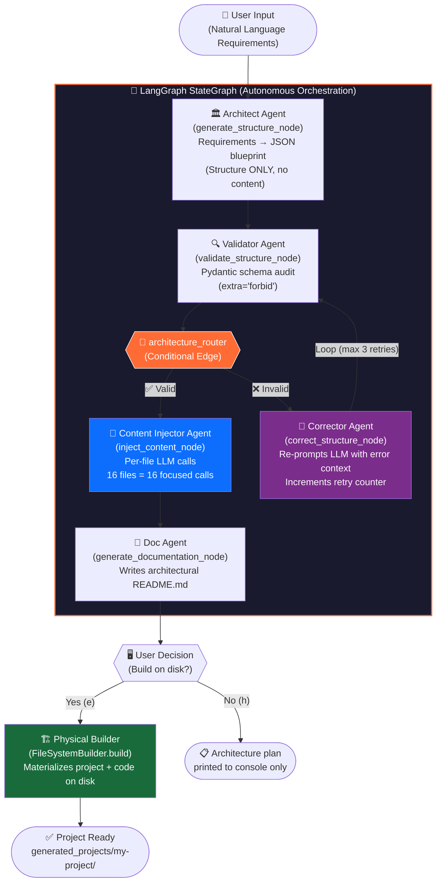

<div align="center">

# 🏗️ Agentic-Project-Architect

### *Autonomous software architectures built by a multi-agent system powered by LangGraph & local Llama 3*

<br/>

[](https://python.org)
[](https://python.langchain.com/docs/langgraph)
[](https://python.langchain.com)
[](https://ollama.com)
[](LICENSE)

<br/>

> **"Don't just generate code. Architect it."**
> 
> This is not a code snippet generator. This is an **autonomous multi-agent orchestration system** that thinks, validates, self-corrects, and physically materializes complete software project structures — with real boilerplate code inside every file — entirely on your local machine.

<br/>

---
</div>

## 🧠 The Philosophy

Modern AI tools write code. **Agentic-Project-Architect** does something fundamentally different: it *thinks like a software architect*.

When you describe a project, a team of specialized AI agents is assembled. They debate, validate, and correct each other's output in a closed feedback loop — just like a real engineering team — before a single folder is created on disk. The result is a production-grade project scaffold with rationale-backed architecture, real boilerplate code, and a full README, generated in seconds, running 100% locally.

---

## ✨ Core Features

### 🤖 Multi-Agent Workflow (5 Agents)
Five specialized agents collaborate in a two-phase pipeline:

| Agent | Role | Technology |
|---|---|---|
| **Architect Agent** | Translates natural language requirements into a structured JSON architecture blueprint | `StructureGenerator` + Llama 3 |
| **Validator Agent** | Audits the blueprint against a strict Pydantic-enforced schema (`extra='forbid'`), rejecting any malformed output | `JsonValidator` + Schema Rules |
| **Corrector Agent** | Receives validation failures and autonomously re-prompts Llama 3 for a corrected blueprint | `JsonCorrector` + Llama 3 |
| **Content Injector Agent** | Walks the validated tree and generates real boilerplate code for each file via **individual, focused LLM calls** | `ContentGenerator` + Llama 3 |
| **Doc Agent** | Consumes the enriched architecture and writes a deep, developer-grade `README.md` | `DocGenerator` + Llama 3 |

### 🔄 Two-Phase Pipeline with Self-Correction Loop

The backbone of this system is a **LangGraph `StateGraph`** — a directed graph where each node is a stateful, isolated agent. The key innovation is the **two-phase architecture**:

**Phase 1 — Structure Generation:** The Architect Agent generates ONLY the folder/file tree. No content. This keeps the task small enough for any local model to handle accurately.

**Phase 2 — Per-File Content Injection:** The Content Injector Agent walks the validated tree and makes **individual, focused LLM calls** for each file. Instead of asking one model call to generate everything, each file gets its own dedicated generation call — the same decomposition strategy used by professional AI coding tools like Cursor.

```python
class PipelineState(TypedDict):
    requirements: str           # User's natural language input
    structure: Optional[str]    # The JSON architecture blueprint (enriched with content)
    documentation: Optional[str]  # Generated README.md content
    error: Optional[str]        # Validation failure message
    json_retries: int           # Self-correction loop counter
```

After validation, the system *decides its own next action* via conditional edges:

- ✅ **Valid** → proceed to content injection, then documentation
- ❌ **Invalid** → enter self-correction loop, retry up to `MAX_RETRIES` times, then re-validate

This is not a simple pipeline. It is a **feedback-driven control system**.

### 🛡️ Strict Schema Validation with Pydantic

The Validator Agent uses Pydantic v2 with `extra='forbid'` — meaning any hallucinated JSON fields that don't match the schema are immediately caught and rejected. This prevents the LLM from silently producing malformed output that would otherwise slip through.

### 🧹 Robust LLM Output Cleaning

A multi-layered regex-based cleaner (`core/utils.py` + `ContentGenerator._clean_llm_output`) strips:
- Markdown code block wrappers (`` ```python ... ``` ``)
- Trailing `Note:` / `Explanation:` commentary
- Standalone `` ``` `` artifacts
- Any conversational text the model appends after code

### 🔒 100% Local & Secure (Zero Data Egress)

All inference runs through **Ollama** (`http://localhost:11434`) on your local machine. Your proprietary requirements, business logic descriptions, and architecture decisions **never leave your hardware**.

- No OpenAI API keys
- No cloud dependencies
- No telemetry
- Configurable model via `Config.OLLAMA_MODEL` (defaults to `llama3`)

---

## 🛠️ Tech Stack

| Layer | Technology | Purpose |
|---|---|---|
| **Orchestration** | LangGraph `StateGraph` | Agent workflow & conditional routing |
| **Chain Primitives** | LangChain Core | Prompt management & model abstraction |
| **LLM Inference** | Llama 3 via Ollama | All generation & correction tasks |
| **Runtime** | Python 3.10+ | Core logic & file system operations |
| **Schema Validation** | Pydantic v2 (`extra='forbid'`) | Strict state & blueprint enforcement |
| **Output Cleaning** | Regex (`re` module) | LLM hallucination stripping |

---

## ⚙️ How It Works — The Pipeline



### Node Breakdown

#### 1. `generate_structure` — The Architect Agent
Receives raw requirements and generates ONLY the folder/file tree as JSON. No code content is produced here — this keeps the task focused and prevents the model from being overwhelmed.

#### 2. `validate_structure` — The Validator Agent  
Runs the JSON through Pydantic v2 with `extra='forbid'`. Catches missing fields (`root_name`, `items`), incorrect types, hallucinated extra fields, and recursive child integrity issues. Sets `error` in state on failure — **this is the trigger for the self-correction loop**.

#### 3. `correct_structure` — The Corrector Agent  
Receives the invalid JSON *and* the error message, plus the correct schema definition. Re-queries the LLM with full context. Maintains a `json_retries` counter; raises `ValueError` after `MAX_RETRIES`.

#### 4. `inject_content` — The Content Injector Agent  
The key innovation. Walks the validated structure tree and makes **individual, focused LLM calls** for each important file. A `requirements.txt` gets one call, a `main.py` gets another, a `Dockerfile` gets its own. Each call is small enough for even an 8B model to handle accurately. Output is cleaned through a multi-layered regex pipeline.

#### 5. `generate_documentation` — The Doc Agent  
Given the enriched architecture JSON (with all code content) and original requirements, generates a comprehensive README.md.

#### 6. `FileSystemBuilder` — The Physical Builder  
A deterministic (non-AI) component using `pathlib` that walks the final JSON tree and performs real I/O: creates directories, writes boilerplate code from `content` fields, and places the README.

---

## 🚀 Getting Started

### Prerequisites

- Python 3.10+
- [Ollama](https://ollama.com) installed and running
- Llama 3 model pulled locally

### 1. Pull Llama 3 via Ollama

```bash
ollama pull llama3
```

### 2. Clone & Install Dependencies

```bash
git clone https://github.com/Muhammed-21mustafa/Agentic-Scaffold-Architect.git
cd Agentic-Scaffold-Architect
pip install -r requirements.txt
```

### 3. Run the Architect

```bash
python main.py
```

Example prompt:
```
Project Requirements: > Build a FastAPI REST API for a todo application with Python.
                        Include database models with SQLAlchemy, Pydantic schemas,
                        CRUD endpoints, and a Dockerfile for deployment.
```

### 4. Watch the Agents Work

```
[*] Ajan (Mimar): İhtiyaçlar analiz ediliyor...
[+] Linter: Plan hatasız, onaylandı.
[*] Ajan (Kod Enjektörü): Her dosya için boilerplate kod üretiliyor...
    [1/16] Kod enjekte ediliyor -> docker-compose.yml
    [2/16] Kod enjekte ediliyor -> Dockerfile
    [3/16] Kod enjekte ediliyor -> requirements.txt
    ...
    [16/16] Kod enjekte ediliyor -> tests/__init__.py
[+] Kod enjeksiyonu tamamlandı.
[*] Ajan (Belgelendirici): README yazılıyor...
[+] Belgelendirme tamamlandı.

=== JENERASYON BAŞARIYLA TAMAMLANDI ===
Build this project? (e/h): > e
[BAŞARILI] Projeniz hazır! Konum: generated_projects/my_todo_app
```

---

## 📁 Project Structure

```
Agentic-Project-Architect/
│
├── main.py                        # Entry point & user I/O
│
├── core/
│   ├── graph.py                   # 🧠 LangGraph StateGraph (5 nodes + conditional edges)
│   ├── state.py                   # PipelineState TypedDict (shared agent memory)
│   ├── config.py                  # Pydantic Config (Ollama host, model, retry limits, output dir)
│   ├── llm_client.py              # Zero-dependency Ollama REST client (urllib only)
│   ├── filesystem.py              # FileSystemBuilder (pathlib-based scaffold engine)
│   └── utils.py                   # Regex utilities (extract_json, extract_markdown)
│
├── generators/
│   ├── structure_generator.py     # Phase 1: Requirements → JSON blueprint (structure only)
│   ├── content_generator.py       # Phase 2: Per-file boilerplate code injection
│   └── doc_generator.py           # Phase 3: Architecture → README.md
│
├── validators/
│   └── json_validator.py          # Pydantic schema validator (extra='forbid')
│
├── correctors/
│   └── json_corrector.py          # Self-correction agent (LLM-powered repair)
│
├── prompts/
│   └── structure_prompts.py       # All system & user prompts (3 phases + correction)
│
├── schemas/
│   └── folder_schema.py           # Pydantic v2 schemas (Node + FolderStructure)
│
└── requirements.txt
```

---

## 🔧 Configuration

All system parameters are centralized in `core/config.py`:

```python
class Config(BaseModel):
    OLLAMA_HOST: str = "http://localhost:11434"
    OLLAMA_MODEL: str = "llama3"
    MAX_RETRIES: int = 3
    TIMEOUT_SECONDS: int = 120
    OUTPUT_DIR: str = "generated_projects"
```

---

## 🧩 Architecture Deep Dive

### Why a Two-Phase Pipeline?

Asking a single LLM call to generate both structure AND content for all files overwhelms small models (8B parameters). The two-phase approach decomposes this into manageable tasks — exactly how production AI coding tools work.

### Why Per-File Content Injection?

Each file gets its own LLM call because:
1. **Focus** — The model only thinks about one file at a time
2. **Quality** — Smaller context = fewer hallucinations
3. **Resilience** — If one file's generation fails, others are unaffected
4. **Scalability** — Works for 5 files or 50 files

### Why `extra='forbid'` in Pydantic?

Without it, LLMs can hallucinate extra JSON fields (like `"project_name"` instead of `"root_name"`) and the validator silently ignores them. With `extra='forbid'`, any unexpected field triggers the self-correction loop.

### Why is the OllamaClient zero-dependency?

`core/llm_client.py` uses only Python's built-in `urllib` — no `requests`, no `httpx`. This minimizes the dependency footprint and makes the inference layer fully auditable.

### 🛡️ Fault-Tolerant AI Architecture: Defeating Context Poisoning

When building this pipeline, we discovered a fascinating LLM phenomenon: **Context Poisoning**. 
Because the system passes previously generated code to the next agent (Cross-File Context), the LLM becomes biased. If the agent generates 10 Python files and then needs to generate a `docker-compose.yml`, the 8B model sees so much Python in its context that it "forgets" it's writing YAML and hallucinates Python imports inside the Docker config!

To solve this and other stubborn LLM hallucinations, we implemented a true fault-tolerant architecture:
1. **Smart Context Filtering:** The pipeline analyzes file extensions. If the target is not a `.py` file, it actively hides the Python context from the LLM, neutralizing Context Poisoning.
2. **Regex Post-Processing (The Safety Net):** Even with strict prompts, small models might hallucinate backend initializations (like `app = FastAPI()`) inside models or schemas. Our builder includes a post-processing step that runs RegEx filters over generated models/schemas to physically strip out hallucinated framework initializations before they reach the disk.

This elevates the project from a simple "API wrapper" to a robust, self-healing **AI Agent Orchestrator**.

### The Self-Correction Loop

```
validate_structure → [error detected] → correct_structure
       ↑                                        |
       └──────────────────────────────────────→ ┘
                  (retry counter++)
```

The corrector agent now receives the **correct schema definition** alongside the error, so it knows exactly what fields to fix.

---

## 🗺️ Roadmap

- [ ] **Streaming output** — real-time token streaming from Ollama during generation
- [ ] **Web UI** — FastAPI + React frontend for visual agent monitoring
- [ ] **Multi-model support** — assign different models to different agents
- [ ] **Git initialization** — auto `git init`, `.gitignore` generation & initial commit
- [ ] **Docker Compose scaffold** — generate `Dockerfile` and `docker-compose.yml` per service

---

## 🤝 Contributing

Contributions are welcome. If you have ideas for new agents, improved prompts, or additional target architectures, please:

1. Fork the repository
2. Create a feature branch: `git checkout -b feature/my-new-agent`
3. Commit your changes: `git commit -m 'feat: add Go microservice architecture support'`
4. Open a Pull Request

---

## 📄 License

This project is licensed under the MIT License. See [LICENSE](LICENSE) for details.

---

<div align="center">

**Built with LangGraph · Powered by Llama 3 · Runs 100% locally**

*If this project sparked an idea, give it a ⭐ — it helps more engineers discover it.*

</div>
