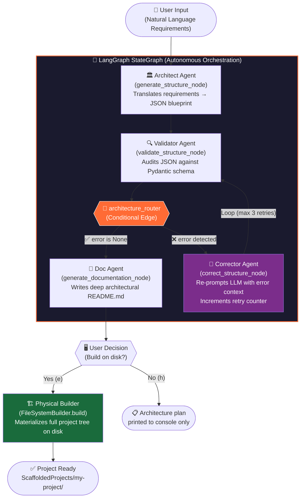

<div align="center">

# 🏗️ Agentic-Project-Architect

### *Autonomous software architectures built by a multi-agent system powered by LangGraph & local Llama 3*

<br/>

[](https://python.org)
[](https://python.langchain.com/docs/langgraph)
[](https://python.langchain.com)
[](https://ollama.com)
[](LICENSE)

<br/>

> **"Don't just generate code. Architect it."**
> 
> This is not a code snippet generator. This is an **autonomous multi-agent orchestration system** that thinks, validates, self-corrects, and physically materializes complete software project structures — entirely on your local machine.

<br/>

---
</div>

## 🧠 The Philosophy

Modern AI tools write code. **Agentic-Project-Architect** does something fundamentally different: it *thinks like a software architect*.

When you describe a project, a team of specialized AI agents is assembled. They debate, validate, and correct each other's output in a closed feedback loop — just like a real engineering team — before a single folder is created on disk. The result is a production-grade project scaffold with rationale-backed architecture and a full README, generated in seconds, running 100% locally.

---

## ✨ Core Features

### 🤖 Multi-Agent Workflow
Three specialized agents collaborate in a defined pipeline:

| Agent | Role | Technology |
|---|---|---|
| **Architect Agent** | Translates natural language requirements into a structured JSON architecture blueprint | `StructureGenerator` + Llama 3 |
| **Validator Agent** | Audits the blueprint against a strict Pydantic-enforced schema, rejecting any malformed output | `JsonValidator` + Schema Rules |
| **Corrector Agent** | Receives validation failures and autonomously re-prompts Llama 3 for a corrected blueprint | `JsonCorrector` + Llama 3 |
| **Doc Agent** | Consumes the validated architecture and writes a deep, developer-grade `README.md` | `DocGenerator` + Llama 3 |
| **Builder Agent** | Walks the final JSON tree and physically materializes the project on disk | `FileSystemBuilder` |

### 🔄 State Machine Architecture with Self-Correction Loop

The backbone of this system is a **LangGraph `StateGraph`** — a directed graph where each node is a stateful, isolated agent. The system carries a shared `PipelineState` object across all nodes:

```python
class PipelineState(TypedDict):
    requirements: str       # User's natural language input
    structure: Optional[str]   # The JSON architecture blueprint
    documentation: Optional[str]  # Generated README.md content
    error: Optional[str]        # Validation failure message
    json_retries: int           # Self-correction loop counter
```

The key innovation is the **conditional edge** — the graph's routing logic. After validation, the system *decides its own next action*:

- ✅ **Valid** → proceed to documentation generation
- ❌ **Invalid** → enter self-correction loop, retry up to `MAX_RETRIES` times, then re-validate

This is not a simple pipeline. It is a **feedback-driven control system**.

### 🔒 100% Local & Secure (Zero Data Egress)

All inference runs through **Ollama** (`http://localhost:11434`) on your local machine (WSL2/Ubuntu or native). Your proprietary requirements, business logic descriptions, and architecture decisions **never leave your hardware**.

- No OpenAI API keys
- No cloud dependencies
- No telemetry
- Configurable model via `Config.OLLAMA_MODEL` (defaults to `llama3`)

### 🏗️ Automated Physical Scaffolding

The `FileSystemBuilder` transforms the agent's JSON blueprint into a real directory tree on disk:

```json
{
  "root_name": "my-ecommerce-platform",
  "items": [
    { "name": "backend", "type": "folder", "children": [
      { "name": "src", "type": "folder", "children": [
        { "name": "main", "type": "folder", "children": [...] }
      ]}
    ]},
    { "name": "frontend", "type": "folder", "children": [...] },
    { "name": "README.md", "type": "file" }
  ]
}
```

The builder recursively walks this tree, creates every `folder` and `file`, injects scaffold headers into source files, and writes the AI-generated `README.md` into the project root — ready to open in VSCode, Cursor, or any AI-powered IDE.

---

## 🛠️ Tech Stack

| Layer | Technology | Purpose |
|---|---|---|
| **Orchestration** | LangGraph `StateGraph` | Agent workflow & conditional routing |
| **Chain Primitives** | LangChain Core | Prompt management & model abstraction |
| **LLM Inference** | Llama 3 via Ollama | All generation & correction tasks |
| **Runtime** | Python 3.10+ | Core logic & file system operations |
| **Schema Validation** | Pydantic v2 | State & config enforcement |
| **Target Architectures** | Java Spring Boot, React, Django, Flutter, Go, etc. | Generated scaffolds |

---

## ⚙️ How It Works — The Pipeline

The following diagram illustrates the full execution flow of the agent system:



### Node Breakdown

#### 1. `generate_structure` — The Architect Agent
Receives raw requirements, constructs a role-injected system prompt (`STRUCTURE_GENERATION_SYSTEM`), and sends it to the local Ollama instance with `format="json"` enforced. Returns a raw JSON string representing the full project architecture.

#### 2. `validate_structure` — The Validator Agent  
Runs the JSON string through a structural validator. Checks for required fields (`root_name`, `items`), correct `type` values (`folder` | `file`), and recursive child integrity. Sets `error` in state on failure — **this is the trigger for the self-correction loop**.

#### 3. `correct_structure` — The Corrector Agent  
Receives the invalid JSON *and* the error message, constructs a correction-focused prompt (`JSON_CORRECTION_SYSTEM`), and re-queries the LLM. Maintains a `json_retries` counter; raises `ValueError` after `MAX_RETRIES` to prevent infinite loops.

#### 4. `generate_documentation` — The Doc Agent  
Given the validated architecture JSON and original requirements, generates a comprehensive, developer-grade `README.md` using the `DOC_GENERATION_SYSTEM` prompt. Output is cleaned of any potential markdown hallucinations.

#### 5. `FileSystemBuilder` — The Physical Builder  
A deterministic (non-AI) component that walks the final JSON tree and performs real I/O: creates directories with `os.makedirs`, initializes source files with scaffold headers, and writes the AI-generated README to the project root.

---

## 🚀 Getting Started

### Prerequisites

- Python 3.10+
- [Ollama](https://ollama.com) installed and running (native or via WSL2/Ubuntu)
- Llama 3 model pulled locally

### 1. Pull Llama 3 via Ollama

```bash
ollama pull llama3
```

Verify Ollama is reachable:
```bash
curl http://localhost:11434/api/generate -d '{"model": "llama3", "prompt": "Hello", "stream": false}'
```

### 2. Clone & Install Dependencies

```bash
git clone https://github.com/your-username/Agentic-Project-Architect.git
cd Agentic-Project-Architect
pip install -r requirements.txt
```

### 3. Run the Architect

```bash
python main.py
```

You will be greeted with a prompt:
```
Welcome to the AI Solutions Architect (Multi-Agent Pipeline)
------------------------------------------------------------
Describe your project, including the tech stack and specific requirements.

Project Requirements: > Build a Spring Boot REST API backend with a React frontend
                         for an e-commerce platform. Include JWT auth, a PostgreSQL 
                         database, and a clean microservices-ready folder structure.
```

### 4. Review & Scaffold

After agent execution, the system will print:
- The full JSON architecture blueprint
- A preview of the generated README
- A prompt to physically build the project on disk

```
=== GENERATION COMPLETE ===
--- [PROJECT ARCHITECTURE SCHEMA] ---
{ "root_name": "ecommerce-platform", ... }

--- [ARCHITECTURAL README PREVIEW] ---
# Ecommerce Platform — Architectural Guide ...

Build this project's template on disk? (y/n): > y

[PHYSICAL BUILD] Connecting to filesystem...
[SUCCESS] Project ready at: C:\Users\...\ScaffoldedProjects\ecommerce-platform
```

---

## 📁 Project Structure

```
Agentic-Project-Architect/
│
├── main.py                     # Entry point & user I/O
│
├── core/
│   ├── graph.py                # 🧠 LangGraph StateGraph definition & node wiring
│   ├── state.py                # PipelineState TypedDict (shared agent memory)
│   ├── config.py               # Pydantic Config (Ollama host, model, retry limits)
│   ├── llm_client.py           # Zero-dependency Ollama REST client
│   ├── filesystem.py           # FileSystemBuilder (physical scaffold engine)
│   └── orchestrator.py         # Legacy synchronous pipeline (v1 reference)
│
├── generators/
│   ├── structure_generator.py  # Architect Agent: requirements → JSON blueprint
│   └── doc_generator.py        # Doc Agent: architecture → README.md
│
├── validators/
│   └── json_validator.py       # Schema validator for architecture blueprints
│
├── correctors/
│   └── json_corrector.py       # Self-correction agent (LLM-powered repair)
│
├── prompts/
│   └── structure_prompts.py    # All system & user prompts (role-injected)
│
├── schemas/                    # Pydantic validation schemas
└── requirements.txt
```

---

## 🔧 Configuration

All system parameters are centralized in `core/config.py`:

```python
class Config(BaseModel):
    OLLAMA_HOST: str = "http://localhost:11434"  # Ollama API endpoint
    OLLAMA_MODEL: str = "llama3"                 # Target model (swap for llama3:70b, mistral, etc.)
    MAX_RETRIES: int = 3                         # Max self-correction loop iterations
    TIMEOUT_SECONDS: int = 120                   # LLM response timeout
```

To use a different local model (e.g., Mistral, CodeLlama), simply change `OLLAMA_MODEL`:

```bash
ollama pull codellama
```
```python
# core/config.py
OLLAMA_MODEL: str = "codellama"
```

---

## 🧩 Architecture Deep Dive

### Why LangGraph over a simple chain?

A linear chain (`A → B → C`) cannot handle errors. LangGraph's `StateGraph` enables **cyclic execution** — the correction loop (`validate → correct → validate`) is impossible to model cleanly in a standard LangChain expression.

### Why is the `OllamaClient` zero-dependency?

`core/llm_client.py` uses only Python's built-in `urllib` — no `requests`, no `httpx`. This is an intentional design choice to minimize the dependency footprint and make the inference layer auditable and portable.

### Why is `FileSystemBuilder` separate from the graph?

Physical I/O is deterministic and side-effectful. Keeping it outside the graph maintains the **purity of the agent pipeline** — nodes only mutate state, never the filesystem. This also makes the graph independently testable.

### The Self-Correction Loop — A Key Design Pattern

```
validate_structure → [error detected] → correct_structure
       ↑                                        |
       └──────────────────────────────────────→ ┘
                  (retry counter++)
```

This feedback loop mirrors how senior engineers review and push back on junior architects' plans. The `json_retries` counter in `PipelineState` is the circuit breaker — preventing infinite recursion while allowing the system enough attempts to converge on a valid solution.

---

## 🗺️ Roadmap

- [ ] **Streaming output** — real-time token streaming from Ollama during generation
- [ ] **Web UI** — FastAPI + React frontend for visual agent monitoring
- [ ] **Template Library** — pre-validated architecture templates (microservices, monorepo, etc.)
- [ ] **Multi-model support** — assign different models to different agents (e.g., `codellama` for structure, `llama3` for docs)
- [ ] **Git initialization** — auto `git init`, `.gitignore` generation & initial commit
- [ ] **Docker Compose scaffold** — generate `Dockerfile` and `docker-compose.yml` per service
- [ ] **LangSmith tracing integration** — full agent execution telemetry (opt-in)

---

## 🤝 Contributing

Contributions are welcome. If you have ideas for new agents, improved prompts, or additional target architectures, please:

1. Fork the repository
2. Create a feature branch: `git checkout -b feature/my-new-agent`
3. Commit your changes: `git commit -m 'feat: add Go microservice architecture support'`
4. Open a Pull Request

---

## 📄 License

This project is licensed under the MIT License. See [LICENSE](LICENSE) for details.

---

<div align="center">

**Built with LangGraph · Powered by Llama 3 · Runs 100% locally**

*If this project sparked an idea, give it a ⭐ — it helps more engineers discover it.*

</div>
